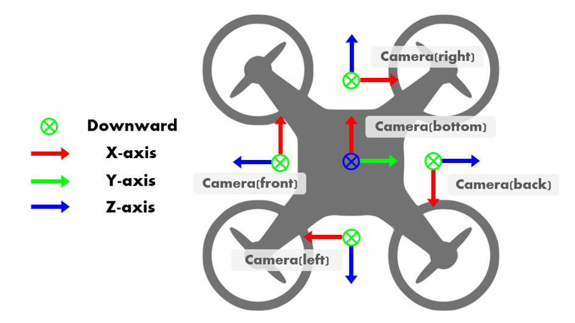
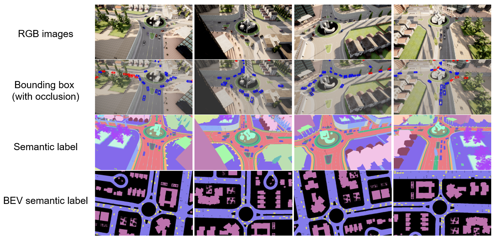
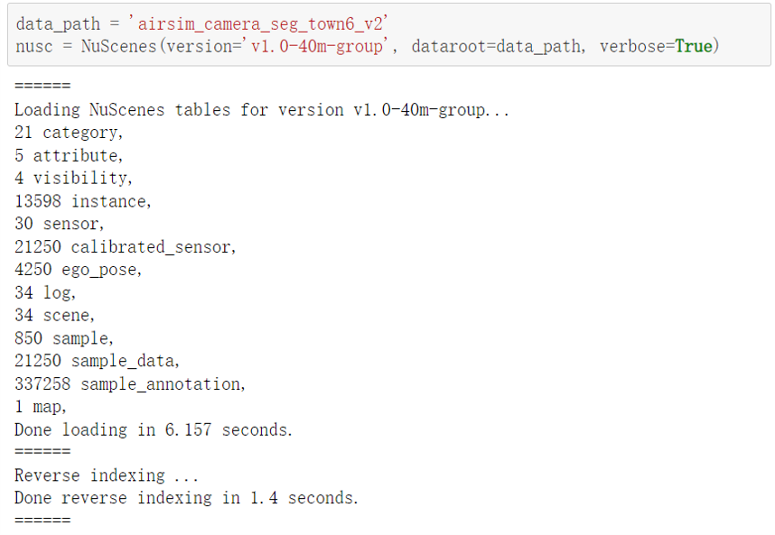


## About Coperception-UAV Dataset

<!--  -->


Coperception-UAV is the first comprehensive dataset for UAV-based collaborative perception.

A UAV swarm has the potential to distribute tasks and achieve better, faster, and more robust performances than a single UAV. To realize this, we need to integrate collaboration ability into the entire pipeline, including perception, planning, control. Among those tasks, collaborative perception enables holistic scene understanding from multiple perspectives via the collaboration of multiple UAVs, which could fundamentally resolve the occlusion issue and the long-range issue in the traditional single-agent perception. Recently, planning and control of a UAV swarm have been intensively studied; however, the collaborative perception remains under-explored due to the lack of a comprehensive dataset. This work aims to fill this gap and proposes a collaborative perception dataset for UAV swarm. 

Based on the co-simulation platform of AirSim and CARLA, our dataset consists of 131.9k synchronous images collected from 5 coordinated UAVs flying at 3 altitudes over 3 simulated towns with 2 swarm formations. Each image is fully annotated with the pixel-wise semantic segmentation labels and 2D/3D bounding boxes of vehicles. We further build a benchmark on the proposed dataset by evaluating a variety of related multi-agent collaborative methods on multiple perception tasks, including object detection, semantic segmentation, and bird’seye-view (BEV) semantic segmentation. 

## Simulation Setting

Our proposed dataset is collected by the co-simulation of CARLA and AirSim. We use CARLA to generate complex simulation scenes and traffic flow; and use AirSim to simulate UAV swarm flying in the scene. The flight route of UAVs is controlled by AirSim and sample data are collected randomly at about 4-second intervals.

### Swarm arrangement

The UAV swarm moves and executes tasks in the three-dimensional space, where the situation could be much more complex than those of vehicles or roadside units. In the dataset, two main factors are taken into consideration that may affect the perception
and collaboration patterns of UAV swarms: flight formation and altitude. Each UAV swarm consists of 5 UAVs. We arrange two types of formation modes for a UAV swarm: discipline mode, where all 5 UAVs keeps a consistent and relatively static array, and dynamic mode, where each UAV navigates independently in the scene. The former simulates the situation where the swarm of UAVs is executing a same specific task such as exploring an unknown area, search and rescue; while the latter simulates the monitoring and patrolling tasks in the city.

### Sensor Setup


In the UAV swarm, Each UAV is equipped with 5 RGB cameras in 5 directions and 5 semantic cameras collecting semantic ground truth for RGB cameras.
- 90° horizontal FoV
- 1 bird’s eye view camera and 4 cameras facing forward, backward, right, and left with a pitch degree of −45°
- image size: 800x450 pixels


## Data

Fully-annotated data are provided in the dataset, including synchronous images with pixel-wise semantic labels, 2D & 3D bounding boxes of vehicles, and BEV semantic map.



**Camera data** We collect synchronous images from all cameras on 5 UAVs, which is 25 images in a sample. In total, 123.8K images are collected for the discipline swarm mode and 8.1K for the dynamic swarm mode. We provide semantic label for each image.

**Bounding boxes** 3D bounding boxes of vehicles are recorded at the same moment with images, including location (x, y, z), rotation (w, x, y, z in quaternion) in the global coordinate and their length, width and height. To specifically address the occlusion issue, we also provide a binary label for the occlusion status of each bounding box.

**BEV semantic label** We provide BEV segmentation labels of four categories: roadway, building, vehicle, and others, which are the key elements to construct the layout of a city and foreground objects. The resolution of the BEV map is 0.25m×0.25m.

## Usage


The dataset is organized in a similar way with the widelyused autonomous driving dataset, nuScenes; so it can be used directly with the well-established nuScenes-devkit.

## Citation
```
To Be Done
```