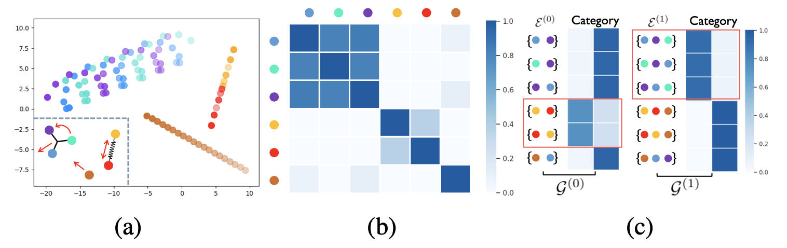
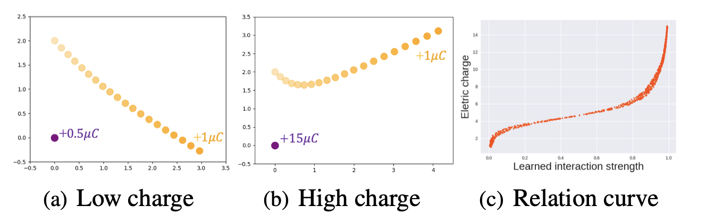

## Abstract
Demystifying the interactions among multiple agents from their past trajectories is fundamental to precise and interpretable trajectory prediction. However, previous works only consider pair-wise interactions with limited relational reasoning. To promote more comprehensive interaction modeling for relational reasoning, we propose GroupNet, a multiscale hypergraph neural network, which is novel in terms of both interaction capturing and representation learning. From the aspect of interaction capturing, we propose a trainable multiscale hypergraph to capture both pair-wise and group-wise interactions at multiple group sizes. From the aspect of interaction representation learning, we propose a three-element format that can be learnt end-to-end and explicitly reason some relational factors including the interaction strength and category. We apply GroupNet into both CVAE-based prediction system and previous state-of-the-art prediction systems for predicting socially plausible trajectories with relational reasoning. To validate the ability of relational reasoning, we experiment with synthetic physics simulations to reflect the ability to capture group behaviors, reason interaction strength and interaction category. To validate the effectiveness of prediction, we conduct extensive experiments on three real-world trajectory prediction datasets, including NBA, SDD and ETH-UCY; and we show that with GroupNet, the CVAE-based prediction system outperforms state-of-the-art methods. We also show that adding GroupNet will further improve the performance of previous state-of-the-art prediction systems. 

## Result
### On the relational reasoning
Visualization of learnt group behavior. (a) The particle trajectories containing a three-group with a light bar, a two-group with a spring and an individual particle. (b) The heatmap of the learnt affinity matrix via affinity modeling. (c) The multiscale hypergraph topology via hyperedge forming and the interaction category vector of each hyperedge. The red box represents the three-group and two-group we inferred.


Particles' trajectories and the curve of neural interaction strength with particle's electric charge. We see that the neural interaction strength has a proportional relationship with the amount of charge, reflecting our model is capable to implicitly capture the interaction strength in an unsupervised manner. 


Visualization results on the NBA dataset. We plot the best trajectory among 20 predictions for the state-of-the-art method (NMMP), GroupNet with the CVAE framework (Ours) and ground truth (GT). The red/blue color represents players of two teams and the green color represents the basketball. Light color represents the past trajectory.


## Citation
```
@InProceedings{xu2022GroupNet,
author = {Xu, Chenxin and Li, Maosen and Ni, Zhenyang and Zhang, Ya and Chen, Siheng},
title = {GroupNet: Multiscale Hypergraph Neural Networks for Trajectory Prediction with Relational Reasoning},
booktitle = {The IEEE/CVF Conference on Computer Vision and Pattern Recognition (CVPR)},
year = {2022}
}
```

## Acknowledgement
This research is partially supported by the National Key R&D Program of China under Grant 2021ZD0112801, National Natural Science Foundation of China under Grant 62171276, the Science and Technology Commission of Shanghai Municipal under Grant 21511100900 and CCF-DiDi GAIA Research Collaboration Plan 202112.
