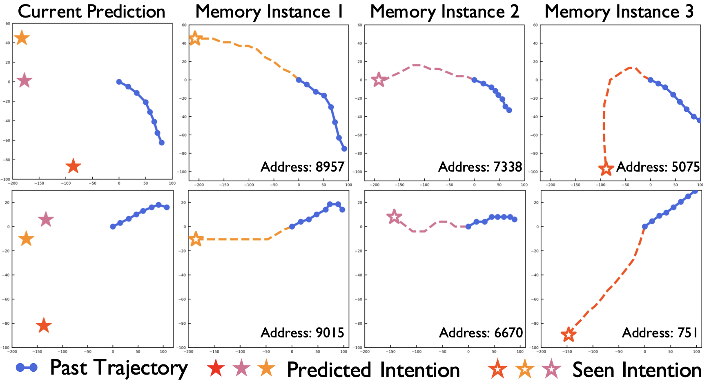

## Abstract
To realize trajectory prediction, most previous methods adopt the parameter-based approach, which encodes all the seen past-future instance pairs into model parameters. However, in this way, the model parameters come from all seen instances, which means a huge amount of irrelevant seen instances might also involve in predicting the current situation, disturbing the performance. To provide a more explicit link between the current situation and the seen instances, **we imitate the mechanism of retrospective memory in neuropsychology and propose MemoNet, an instance-based approach that predicts the movement intentions of agents by looking for similar scenarios in the training data**. In MemoNet, we design a pair of memory banks to explicitly store representative instances in the training set, acting as prefrontal cortex in the neural system, and a trainable memory addresser to adaptively search a current situation with similar instances in the memory bank, acting like basal ganglia. During prediction, MemoNet recalls previous memory by using the memory addresser to index related instances in the memory bank. We further propose a two-step trajectory prediction system, where the first step is to leverage MemoNet to predict the destination and the second step is to fulfill the whole trajectory according to the predicted destinations. Experiments show that the proposed MemoNet improves the FDE by **20.3%/10.2%/28.3%** from the previous best method on SDD/ETH-UCY/NBA datasets. Experiments also show that our MemoNet has the ability to trace back to specific instances during prediction, promoting more interpretability.

## Result

Diverse intention prediction by MemoNet on SDD, where 20 final intentions are clustered from 120 coarse intention anchors. MemoNet can provide diverse and accurate intention predictions.


Prediction cases with corresponding past-future trajectories traced by memory addresser. MemoNet promotes a more explicit link between the current situation and seen instances.

## Citation
```
@InProceedings{MemoNet_2022_CVPR,
   author = {Xu, Chenxin and Mao, Weibo and Zhang, Wenjun and Chen, Siheng},
   title = {Remember Intentions: Retrospective-Memory-based Trajectory Prediction},
   booktitle = {The IEEE/CVF Conference on Computer Vision and Pattern Recognition (CVPR)},
   year = {2022}
}
```

## Acknowledgement
This research is partially supported by the National Key R&D Program of China under Grant 2021ZD0112801, National Natural Science Foundation of China under Grant 62171276, the Science and Technology Commission of Shanghai Municipal under Grant 21511100900 and CCF-DiDi GAIA Research Collaboration Plan 202112.
